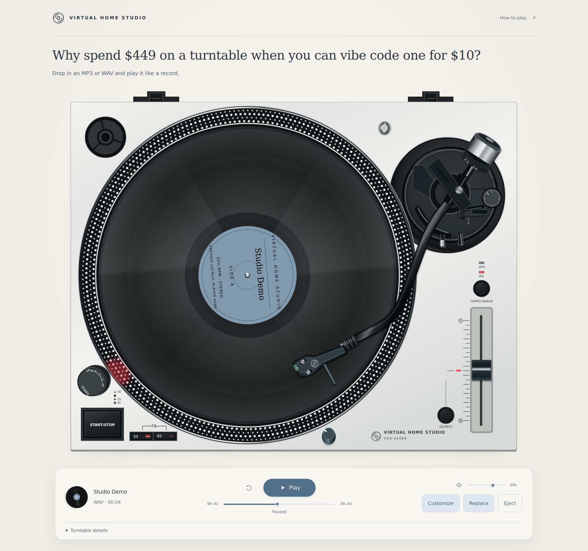
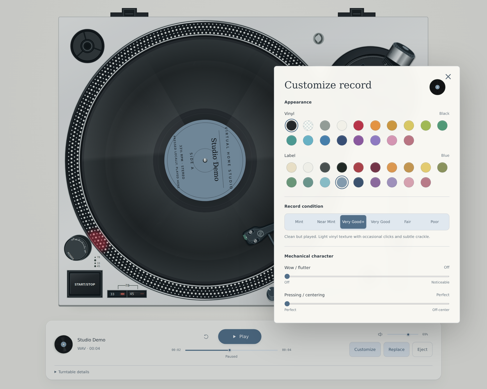

# Virtual Home Studio

> This is 100% vibe coded and I did this because I didn't want to buy a turntable for my home lab lol.

Why spend $449 on a turntable when you can vibe code one for $10?

Choose an MP3 or WAV, or drop one onto the deck and play it like a record.



Meet the VHS-42069, a fictional direct-drive turntable living in your browser. Audio stays local.

## Quick start

Requires Python 3.11+, [uv](https://docs.astral.sh/uv/), and a modern browser. Run from the project directory:

```sh
uv sync
uv run python app.py
```

Open **http://127.0.0.1:42069**. Stop the server with Ctrl+C.

## What it does

- MP3/WAV playback with assisted Play or manual tonearm control.
- **Choose Record / Replace Record** opens a compact source chooser. Pick **Local File**, or drag and drop an MP3/WAV anywhere on the page.
- A bright blue empty-state glow highlights where to begin, with a static highlight when reduced motion is enabled.
- Presets, dialogs and expandable details open and close smoothly; reduced motion keeps them immediate.
- 33⅓ / 45 / 78 RPM, pitch adjustment and Quartz lock.
- Vinyl scratching, direct scrubbing and audible motor transitions.
- Eight turntable finishes, vinyl/label colors, record condition, surface texture and cartridge character.
- Open **Customize** to change the chassis color, including Black, Red, and the default Silver. Colors stay selected through record changes within the session.

<details>
<summary>Turntable and record customization</summary>



</details>

## Controls

| Control | Action |
| --- | --- |
| Play / Pause | Cue automatically / hold your place, with the same spin-up and slowdown as START/STOP |
| Presets | Pick one of seven speed/pitch combinations, or Original to reset; the physical fader glides into place and the sound follows |
| Repeat icon | Replay the current record after it finishes; click again to turn off |
| Tonearm / CUE | Drag to another groove / lift or lower the stylus |
| Vinyl | Drag with the stylus down to scratch; hold still to silence |
| Timeline | Hover to preview, click to seek, drag to scrub |
| 33 + 45 | Press both for 78 RPM |
| Pitch / Quartz | Adjust speed / lock to the selected nominal RPM |
| Return arm | Lift and park the arm; platter stays independent |
| Customize / Replace | Change the turntable finish and record’s look and sound / choose another file |

The source chooser also shows a grey, disabled **YouTube link — Coming soon** placeholder.

Open **How to Play** for the visual cheat sheet and keyboard shortcuts.

## Development

FastAPI serves plain HTML, CSS and JavaScript; there is no frontend build step. Chromium is the tested browser.

```sh
uv sync --group dev
uv run --group dev playwright install chromium
uv run --group dev python tests/acceptance.py
```

Keep the server running in another terminal. Acceptance checks also require `ffmpeg`; DSP tests require Node.js. See [AGENTS.md](AGENTS.md#tests) for the test catalog and development rules.

## More documentation

- [AGENTS.md](AGENTS.md): source map, architecture, invariants and testing.
- [REFERENCE.md](REFERENCE.md): hardware geometry and simulation assumptions.

The physical deck and sound are simulations, not calibrated hardware measurements.
