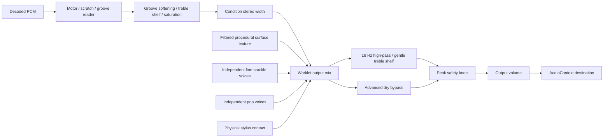

# Vinyl condition audio

## Signal path

Selected files decode once to PCM in the browser and transfer to one persistent worklet. Motor playback, physical scratching and the shared needle-fragment reader use that audio clock; [scrub diagnostics](direct-manipulation.md) explain the separate logical and audible cursors. Wow/flutter changes motor velocity; centering changes groove-read velocity once per revolution.

The cartridge path defaults on and crossfades with its dry bypass. It is separate from record condition. The cartridge's low-frequency filter has a short decay after motor stop; tests wait for measured silence rather than assuming an immediate zero sample.

The final safety curve is linear below 0.9 amplitude and smoothly reduces rare near-full-scale peaks after all coloration, before volume. It prevents added defects/filter overshoot from clipping without continually compressing normal musical levels.

## Calibration rationale

The earlier condition engine reached the master output but was masked by music; the problem was effect balance rather than disconnected routing.

Its strongest profile produced approximately **−66.7 dBFS** surface sound against a **−16.6 dBFS** test chord at 75% volume. A 24% blend of a 6.5 kHz one-pole low-pass attenuated only 0.27 dB at 3.3 kHz and 1.04 dB at 11 kHz, explaining the weak audible difference.

## Shared profiles and processing

`static/condition-profiles.js` defines Mint, Near Mint, Very Good+, Very Good, Fair and Poor for both audio and visual wear. Numeric parameters interpolate from current values over 60 ms; changes send settings without resending PCM, seeking or restarting the motor. Defaults and persistence rules are in [AGENTS.md](../AGENTS.md#audio-and-speed-invariants).

- Surface texture combines filtered random components with condition-dependent level and spectral balance; it is generated continuously, never looped from a short recording.
- Fine crackles and larger pops use separate stochastic schedules and fixed voice pools (eight and four). Each event varies amplitude, duration, frequency, texture, polarity, and stereo position. Occasional stronger Poor pops remain bounded.
- Groove wear blends a fast smoothing filter, attenuates the upper spectrum with a shelf, and adds a parallel soft saturator that affects louder passages more. Bass remains substantially intact.
- Stereo narrowing reduces the side signal progressively; it does not change the playback clock.
- Surface sound requires moving vinyl, actual stylus contact, and power. Contact thumps/releases use independent physical contact edges and their own flag.

Surface, contact, and cartridge flags remain in the authoritative model and command API, but their checkboxes are absent from the primary panel. The advanced surface bypass also removes condition coloration; it preserves the independent contact and cartridge settings.

## Signal measurements

`tests/condition_audio.py` captures the same master output connected to the browser destination. It synthesizes its own stereo musical phrase, silence, calibrated frequency probes, and full-scale stress signal. At the original test volume of 75%, measured surface RMS progresses approximately as follows:

| Condition | Master surface RMS |
| --- | --- |
| Mint | −92.3 dBFS |
| Near Mint | −79.7 dBFS |
| Very Good+ | −65.8 dBFS |
| Very Good | −55.8 dBFS |
| Fair | −46.8 dBFS |
| Poor | −40.1 dBFS |

On calibrated probes, Poor reduces 9.6 kHz by about **7.7 dB**, with approximately **0.18 dB** change at 220 Hz. Returning to Mint restores the measured treble response. Full-scale input with Poor defects at maximum volume peaked at **0.9571**, with no full-scale or nonfinite samples. Exact random-event counts and surface measurements vary with capture timing.

The musical preview `artifacts/condition-ab.wav` contains Mint → Poor → Mint, eight seconds per section. It is intended for listening as well as the automated measurements.

The browser report also records audio-node routing, live playback continuity, and one playback engine/one PCM upload. Sample-level checks independently verify profile progression, harmonic restraint, stereo behavior, nonperiodic defects, and rapid parameter ramps.
